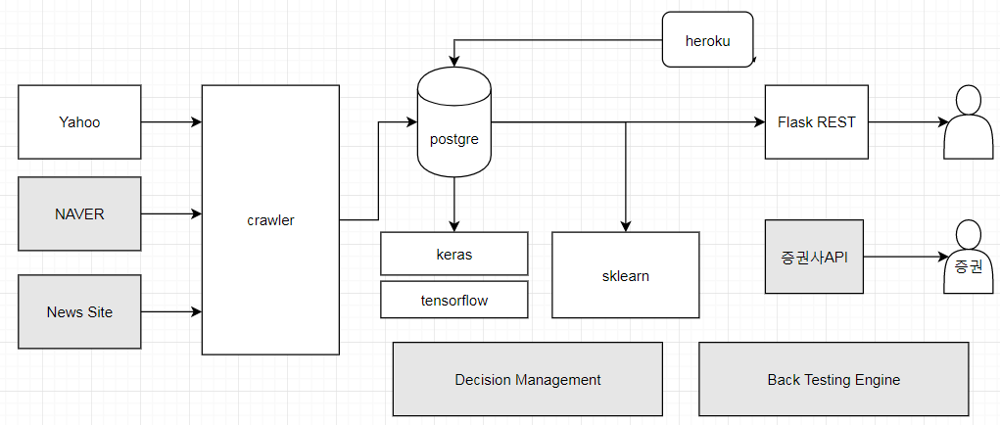
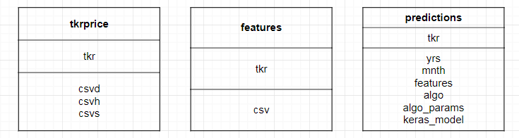

# 머신러닝 이용한 주가예측 프로젝트

## 들어가기에 앞서

개인적으로 Crypto Curruency와 주식, 그리고 부동산에 대한 데이터를 수집하여 미래 자산의 가격의 트렌드를 예측하는데 관심이 많았습니다. 한번 해봐야지 하다가 데이터 수집 정도에만 그쳤는데 마침 미국 산호세에서 GEP하던 중에 링크드인에서 Dan이란 분의 밋업 가서 보고 온 것에 인사이트를 받아 제가 여태까지 깨작 깨작 데이터 수집/저장하는 모듈등을 파이선을 익히면서 배웠던 것들을 모아다가 작은 분석 환경을 만들었습니다. 이를 기반으로 계속 업그레이드를 할 수 있도록 말이요. 그래서 오늘은 그것에 대한 경험담과 향후에 대한 방향을 공유할려고 합니다.

요즘 금융 분석은 컴퓨팅 파워도 올라가고 딥/머신러닝의 기술 발달과 인터넷에서 제공하는 다양한 데이터를 가지고 딥러닝/머신러닝 기술도 익히면서 쉽게 가공된 데이터를 쉽게 API를 이용하여 수집처리가 가능한 시대가 도래했습니다. 퀀트 전문가들이 수학과 통계 기술이 금융계에서 쓰여지면서 활황을 누렸으나 2008년도에 서브프라임등이 터지면서 소강상태였으나 요즘 다시 최근에 혁신을 일으키고 있다고합니다. IT기술을 접목하여 좀 더 관리하면 더 좋을 것 같습니다. 저도 그래서 머신러닝과 데이터 마이닝 기술이 엄청 발전하고 있고 재테크나 은퇴 준비등을 위해서  개인 스스로에게도 도움이 될 것 같습니다.

## Pre-requsities

파이선 공부 필요
 - 점프 투 파이선 온라인 위키북을 보는 걸 추천
 - 가상환경 구축
   http://pythoninreal.blogspot.kr/2013/12/virtualenv.html

앞으로 소개할 개발 환경을 셋업하기 위해서는 아래 목록의 프로그램/라이브러리 설치가 필요합니다.

 - 파이선 3.6
 - 파이선 라이브러리
    - [FlaskRESTful](https://flask-restful.readthedocs.io/en/latest/)
    - [BeuatifulSoup](https://www.crummy.com/software/BeautifulSoup/bs4/doc/)
    - Yahoo Finance API
    - [gevent](http://www.gevent.org/)
    - sklearn
    - Numpy
    - Pandas
    - SQLAlchemy ( 이건 별도로 pip install을 이용하지 않고 msi나 source를 직접 받아 build)
        . http://pythoncentral.io/how-to-install-sqlalchemy/
 - Postgre Database
 - Tensorflow
    - 구글, 머신러닝 위한 프레임워크
 - Keras
    - Tensforflow, Pytorch, Theano 등을 편하게 사용할 수 있게 위한 Framework

## Day 1

### Goal
   1. 주가 예측을 위한 개발 환경 구축에 대한 내용을 위주로 하고자 합니다.
   2. 시간이 허락한다면 머신러닝을 이용한 주가 예측을 간단하게 해보겠습니다.
   (아마도..시간/능력상 안될듯?! 다음 회차로 넘기겠습니다. )

### 가봅시다!!

뭘 만들것이냐.. 아래와 같이 생겼습니다.
회색부분은 아직 모듈을 붙이진 않았고, 현재 프로젝트에 구현된 부분은 하얀색

1. 환경 구축에 사용한 모듈/라이브러리에 대한 설명 with 간단한 예제

    1.1. 주피터 노트북에서 간단하게 주식 정보를 가져와서 이동평균선과 함께 데이터 다뤄보기 [여기](notebook/handson1.ipynb)

    1.2. 야후 파이낸스 API를 사용하여 미국 주식을 크롤링 [여기](api/crawl/yahoo-api.py)

    1.3. postgre db 사용 데모 [여기](api/demo/demosql.py)

    1.4. 케라스를 이용하여 간단한 linear regression 돌려보기 [여기](api/demo/demokeras.py)

    1.5. flaskRESTful 라이브러리를 사용하여 간단한 REST API 만들어보기 [여기](api/demo/demoflask_restful.py)

2. 야후 파이낸스에서 미국 다우존스 주식의 OHLC 가격 정보 가져올 것 [여기](main.py)

3. 위 가격정보를 RDB에 저장. [여기](api/transport/csv2db.py)

아래는 ERD입니다. 초기버젼임을 감안해주시고, tkr에 대한 가격과 특성, 그리고 예측되는 모델이 저장되는 테이블입니다. 여기서 대박인건 keras 모델을 binary로 Postgre 디비에 저장했다가 언제든 재사용가능하다는 점입니다.

4. DB에 저장한 가격정보를 가지고 새로운 피쳐 생성 [여기](api/genf.py)

   - 아래의 피처를 생성하기 위해 Pandas의 Dataframe API를 사용
   - 생성한 피쳐를 다시 Postgre Databse에 저장

|Feature | 용어  | 설명 |
|--|--|--|
| pct_lead | 일일 수익율 |  ( (현재 수정 종가 - 다음날 수정 종가) / 현재 수정 종가 ) * 100  |  
| pct_lag1 | 1일 lag  | ( (현재 수정 종가 - 1일전 수정 종가) / 1일전 수정 종가 ) * 100 |
|pct_lag2 | 2일 lag  | ( (현재 수정 종가 - 2일전 수정 종가) / 2일전 수정 종가 ) * 100 |
|pct_lag3 | 4일 lag  | ( (현재 수정 종가 - 4일전 수정 종가) / 4일전 수정 종가 ) * 100 |
|pct_lag4 | 8일 lag  | ( (현재 수정 종가 - 8일전 수정 종가) / 8일전 수정 종가 ) * 100 |
|slope3| 3일 slope |  100 * (3일 평균 수정 종가 - 전일 3일 평균 수정 종가) / 3일 평균 수정 종가    |
|slope4| 4일 slope |  100 * (4일 평균 수정 종가 - 전일 4일 평균 수정 종가) / 4일 평균 수정 종가    |
|slope5| 5일 slope |  100 * (5일 평균 수정 종가 - 전일 5일 평균 수정 종가) / 5일 평균 수정 종가    |
|slope6| 6일 slope |  100 * (6일 평균 수정 종가 - 전일 6일 평균 수정 종가) / 6일 평균 수정 종가    |
|slope7| 7일 slope |  100 * (7일 평균 수정 종가 - 전일 7일 평균 수정 종가) / 7일 평균 수정 종가    |
|slope8| 8일 slope |  100 * (8일 평균 수정 종가 - 전일 8일 평균 수정 종가) / 8일 평균 수정 종가    |
|slope9| 9일 slope |  100 * (9일 평균 수정 종가 - 전일 9일 평균 수정 종가) / 9일 평균 수정 종가    |
|dow_l| day / 100 | 요일(normalize) |
|moy_l| month / 100 | 월(normalize) |

## Day 2

저번에 4번 이후 5번 이어서 나갑니다.

5. 케라스/텐서플로우등을 이용하여 모델 training

##### 모델

 1. sklearn
 2. keras (using TF as a backend)

 1) learn_predict_kerasnn
    파라메터 : tkr, yrs, mnth, features, hl, neurons
    a) 데이터 분류
        .트레이닝/테스트 데이터셋 구분
        .예측하는 시점의 달 이전 데이터는 모두 트레이닝 데이터로
        .예측하고자 하는 년수의 데이터가 없을 경우 로직 종료
        .dataframe과 Numpy arrapy 데이터를 모두 리턴
    b) 모델 생성
        .캐라스 API keras.models.Sequentials() 이용하여 생성
        .Input Layer 정의
            .(인자로 받은) 피처 정의
            .activation함수 정의(linear)
            .Dropout를 overfitting 방지를 위해 정의 (0.1)
        .Hidden Layer 정의
            .Input Layer와 유사하게 정의하나 (인자로 받은) 뉴론을 대신 대입
        .Output Layer 정의
            .결과 값은 단 하나
            .activation함수는 linear로..
            .loss function은 MSE로 하고 optimizer는 atam을 사용
    c) 모델 훈련
        .정의한 에폭과 배치사이즈 기준으로 fit
            kmodel.fit(xtrain_a, ytrain_a, batch_size=batch_size_i, epochs=epochs_nn_i)
        .

 2) learn_predict_kerasnn
    함수와 동일하나 hidden layers, neurons를 따로 받지 않는다.
    즉 파라메터 tkr, yrs, mnth, features만 입력받고 데이터 분류는 동일

    b) 모델 생성
    동일하게 keras를 사용하여 히든레이어 영역없이 동일

6. 모델 또한 binary RDB 저장/재사용
7. flaskRESTful을 이용하여 REST API를 사용하여 가격 정보를 제공하는 웹서비스 구축sklearn과 keras(with tensorflow as a backend)를 사용하여 NN과 linear regression등의 모델을 사용하여 미래 주식 가격 예측

## Day 3

여러가지를 생각중이나,

1. 나쁜 뉴스를 통해서 급락한 종목의 경우 들어가는 것이 옳은지에 대한 판단해주는 모델
  이미 진행하던 것이 있으며, 실제로 IPO시점부터 현재까지의 주식 데이터를 다 조회를 하여 파라메터로 정의한 퍼센티지 이상 떨어진 날짜와 그 전날 수정종가 이상의 가격을 회복한 기간을 모두 구하여 지표로 구해주는 소스 [여기](https://github.com/verystrongjoe/juice)

2. 현재 깃헙의 올라온 소스를 기반으로 DQN을 사용한 강화학습을 통한 주가 sell out 시기 예측하는 것을 돌려보고 있는데 Keras 2.x대의 버그(?) 문제로 계속 trouble shooting중에 있어서 고치든 다른 것으로 우회를 해서 돌려볼 예정.

## 향후계획
1. 액면분할이나 배당 요소도 고려 필요
2. 현재는 뉴럴넷과 Linear Regression 정도 돌려봤으나 강화학습 또한 포함할 예정

## 레퍼런스

1. 링크드인 밋업 Dan의 gitbub fork
https://github.com/verystrongjoe/tkrapi20
https://www.quantinsti.com/blog/machine-learning-trading-predict-stock-prices-regression/
http://spy611.herokuapp.com/
http://reg4.herokuapp.com/
d1d2.us

2. Reinforcement learning
[페북 공유된 강화학습 사례](https://www.facebook.com/groups/TensorFlowKR/permalink/525157697825293/)

[Reinforcement Learning w/ Keras + OpenAI: Actor-Critic Models](https://medium.com/towards-data-science/reinforcement-learning-w-keras-openai-actor-critic-models-f084612cfd69)

[RLCode와 A3C 쉽고 깊게 이해하기](https://www.youtube.com/watch?v=gINks-YCTBs)

3. Sentiment Analysis on Reddit News Headlines with Python’s Natural Language Toolkit (NLTK)
http://www.learndatasci.com/sentiment-analysis-reddit-headlines-pythons-nltk/

4. Siraj Youtube
[여기](https://www.youtube.com/watch?v=JuLCL3wCEAk)

5. 강화학습을 가지고 주식가격 예측 관련 논문
[Reinforcement Learning in Online Stock Trading Systems](http://citeseerx.ist.psu.edu/viewdoc/download?doi=10.1.1.83.5299&rep=rep1&type=pdf)

[Stock Trading with Recurrent Reinforcement Learning (RRL)](http://cs229.stanford.edu/proj2006/Molina-StockTradingWithRecurrentReinforcementLearning.pdf)

[STOCK PRICE PREDICTION USING REINFORCEMENT LEARNING](http://plaza.ufl.edu/yiz21cn/refer/Stock%20price%20prediction%20using%20reinforcement%20learning.pdf)

[Reinforcement Learning for Optimized Trade Execution](https://www.cis.upenn.edu/~mkearns/papers/rlexec.pdf)

[PR-019: Continuous Control with Deep Reinforcement Learning](https://www.youtube.com/watch?v=h2WSVBAC1t4&list=PLlMkM4tgfjnJhhd4wn5aj8fVTYJwIpWkS&index=20&t=17s)

6. etc
[Quant Platform](https://www.quantopian.com/)

[프로그래머를 위한 통계 강의( 파이콘 2016, 미국 )](https://www.youtube.com/watch?v=CRnnarKkm9Y)

https://github.com/llSourcell/Stock_Market_Prediction

https://ntguardian.wordpress.com/2016/09/19/introduction-stock-market-data-python-1/

http://www.learndatasci.com/python-finance-part-yahoo-finance-api-pandas-matplotlib/
